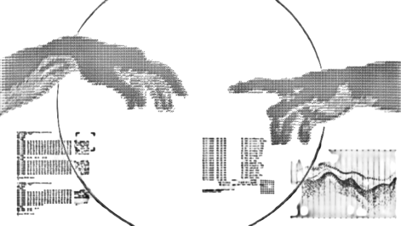
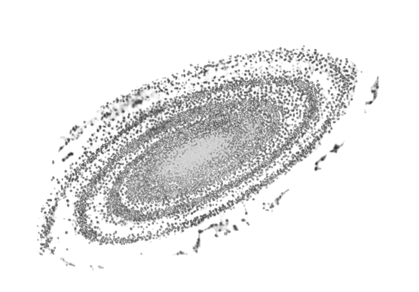

  <h1>Hi! I'm Ronald</h1>
  <b>Backend Developer | Web Pentester | 14 years old</b>
   
  
My goal is simple, to write clean code, to understand as best as possible how the software works, to create safe solutions to everyday problems.

<h2 align="center">Activity Graph</h2>

  

<h2 align="center">About Me </h2>

<h3>Hey! I'm <b>Ronald</b></h3>

- A self-taught **programmer**.
- Currently a backend **developer** and **web pentester**.
- I am **14 years** old. I live in Santa Clara, Villa Clara (**Cuba**). 
- He studied programming a year and a half ago independently. 
- I am currently studying **Node.js** to specialize in API development with **Express**.
- I use **Linux** btw

 
 

<h2 align="center">Tech Stack</h2>

<table align="center">
  <tr>
    <td align="center" width="96">
         
    </td>
    <td align="center" width="96">
         
    </td>
    <td align="center" width="96">
         
    </td>
    <td align="center" width="96">
         
    </td>
    <td align="center" width="96">
        
    </td>
    <td align="center"  width="96">
        
    </td>
    <td align="center" width="96">
        
    </td>
  </tr>

  <tr>
    <td align="center" width="96">
        
    </td>
    <td align="center" width="96">
        
    </td>
    <td align="center" width="96">
        
    </td>
    <td align="center" width="96">
        
    </td>
    <td align="center" width="96">
        
    </td>
    <td align="center" width="96">
        
    </td>
    <td align="center"  width="96">
        
    </td>
  </tr>
</table>

<h2 align="center">Connect</h2>

   &nbsp;
   &nbsp;
   &nbsp;
   &nbsp;
   &nbsp;
   &nbsp;
   &nbsp;

 

<h2 align="center">GitHub Stats</h2>

<table>
  <td>
    
  </td>
  <td>
    
  </td>
</table>

<h2 align="center">Commit Activity</h2>

<picture>
  <source media="(prefers-color-scheme: dark)" srcset="https://raw.githubusercontent.com/ropydev/ropydev/output/pacman-contribution-graph-dark.svg">
  <source media="(prefers-color-scheme: light)" srcset="https://raw.githubusercontent.com/ropydev/ropydev/output/pacman-contribution-graph.svg">
  
</picture>

---

∆ All the tools I post on my profile that are considered "unethical" are solely for local and/or educational testing.

